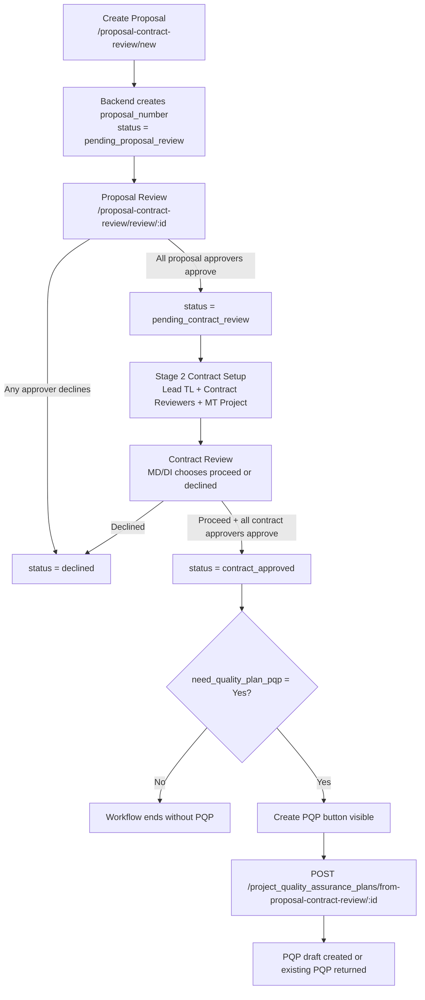

# Proposal และ PQP Workflow Summary

วันที่ตรวจสอบ: 2026-05-29  
Backend: `/Applications/XAMPP/xamppfiles/htdocs/efrom-mh-api`  
Frontend: `/Users/narongkornmankatalyou/Desktop/Angular/e-form`

## 1. ภาพรวม

ระบบ Proposal & Contract Review เป็นจุดเริ่มของ workflow โครงการในหน้า `18 - FORM MTPR-01` เมื่อ Proposal ผ่านขั้น Proposal Review แล้วจะเข้าสู่ Contract Review จากนั้นจึงสร้าง MT Project Number และถ้า Contract Review ผ่านพร้อมเลือกว่าต้องทำ PQP ระบบจึงเปิดให้สร้าง Project Quality Plan ในหน้า `19 - FORM MTQP-01`

ใน backend ใช้ชื่อ model/controller ว่า `ProjectQualityAssurancePlan` หรือ PQA Plan แต่ใน frontend แสดงเป็น Project Quality Plan หรือ PQP ดังนั้นในเอกสารนี้ใช้คำว่า PQP เพื่ออ้างถึง `project_quality_assurance_plans`

## 2. หน้าจอและ API ที่เกี่ยวข้อง

### Frontend route

| หน้าจอ | Route | หน้าที่ |
| --- | --- | --- |
| Proposal list | `/proposal-contract-review/list` | แสดงรายการ Proposal, filter ตาม status, tab งานของฉัน, pending, action |
| Create Proposal | `/proposal-contract-review/new` | สร้าง Proposal ใหม่ |
| Edit Proposal | `/proposal-contract-review/edit/:id` | แก้ไขข้อมูลหลัก หรือ setup contract เมื่อ status เป็น `pending_contract_review` |
| Stage 2 setup | `/proposal-contract-review/stage-2/:id` | setup Contract Review, Lead TL, contract reviewers, สร้าง MT Project Number |
| Proposal view | `/proposal-contract-review/view/:id` | ดูเอกสาร, workflow, MT Projects, และปุ่ม Create PQP |
| Proposal approval | `/proposal-contract-review/review/:id` | หน้าอนุมัติ Proposal/Contract ตาม current stage ของผู้ใช้ |
| MT Projects | `/proposal-contract-review/projects/:id` | เพิ่ม MT Project Number หลัง contract proceed |
| PQP list | `/project-quality-assurance-plan/list` | แสดงรายการ PQP |
| Create PQP manual | `/project-quality-assurance-plan/new` | สร้าง PQP แบบ manual ไม่ผูก Proposal โดยอัตโนมัติ |
| PQP view | `/project-quality-assurance-plan/view/:id` | ดู PQP |
| PQP edit | `/project-quality-assurance-plan/edit/:id` | แก้ไข PQP |

### Backend API

| API | Controller | หน้าที่ |
| --- | --- | --- |
| `GET /api/proposal_contract_reviews/next-number` | `PostmanProposalContractReviewController::nextNumber` | preview Proposal Number ตาม discipline |
| `POST /api/proposal_contract_reviews` | `PostmanProposalContractReviewController::store` | สร้าง Proposal และ approval stage proposal |
| `PUT /api/proposal_contract_reviews/{id}` | `PostmanProposalContractReviewController::update` | แก้ไขข้อมูล หรือ setup Contract Review/MT Project |
| `GET /api/proposal_contract_reviews/{id}` | `PostmanProposalContractReviewController::show` | โหลดข้อมูล Proposal พร้อม approvals/projects |
| `POST /api/proposal_contract_reviews/{id}/proposal-review` | `PostmanProposalContractReviewController::proposalReview` | อนุมัติ/decline Proposal |
| `POST /api/proposal_contract_reviews/{id}/contract-review` | `PostmanProposalContractReviewController::contractReview` | อนุมัติ/decline Contract |
| `GET /api/proposal_contract_reviews/{id}/projects` | `PostmanProposalContractReviewController::projects` | โหลด MT Projects ของ Proposal |
| `POST /api/proposal_contract_reviews/{id}/projects` | `PostmanProposalContractReviewController::storeProject` | เพิ่ม MT Project หลัง proceed |
| `POST /api/project_quality_assurance_plans/from-proposal-contract-review/{id}` | `ProjectQualityAssurancePlanController::createFromProposalContractReview` | สร้าง PQP จาก Proposal ที่ contract approved |
| `GET /api/project_quality_assurance_plans/{id}` | `ProjectQualityAssurancePlanController::show` | โหลด PQP |
| `POST /api/project_quality_assurance_plans` | `ProjectQualityAssurancePlanController::store` | สร้าง PQP manual |
| `PUT /api/project_quality_assurance_plans/{id}` | `ProjectQualityAssurancePlanController::update` | แก้ไข PQP |

## 3. Workflow Proposal ถึง Contract

### 3.1 สร้าง Proposal

1. ผู้ใช้เข้า `/proposal-contract-review/new`
2. Frontend เรียก `GET /api/proposal_contract_reviews/next-number?primary_discipline=...` เพื่อ preview Proposal Number
3. เมื่อ submit frontend ส่ง `POST /api/proposal_contract_reviews`
4. Backend สร้าง Proposal Number จริงอีกครั้งตาม discipline:
   - `general` -> `P0001`, `P0002`, ...
   - `facade` -> `FP0001`, `FP0002`, ...
   - `lighting` -> `LP0001`, `LP0002`, ...
   - `transportation` -> `TP0001`, `TP0002`, ...
5. Backend set status เป็น `pending_proposal_review`
6. Backend สร้าง approval rows เฉพาะ stage `proposal`
7. Backend สร้างหรือ sync `proposal_project_references` เป็น reference ระดับ Proposal โดยยังไม่มี project number

Validation หลัก:

- ต้องมี `project_name`, `city`, `country`, `client_name`, `project_type`, `currency`, `filled_in_by`
- `currency` ต้องเป็น `THB` หรือ `USD`
- ถ้าเลือก fee calculation attached ต้องมี attachment type `fee_calculation` หรือ `fee`
- Proposal reviewers ต้องมีอย่างน้อย 2 คนและห้ามซ้ำ
- ถ้า Proposal decision เป็น submitted ต้องมี `% Win Probability`

### 3.2 อนุมัติ Proposal

1. ผู้อนุมัติเข้าจาก Action Request หรือ `/proposal-contract-review/review/:id`
2. Frontend โหลด Proposal ด้วย `GET /api/proposal_contract_reviews/{id}`
3. Frontend ตรวจ `current_stage` หรือ status:
   - `pending_proposal_review` -> stage `proposal`
   - `pending_contract_review` -> stage `contract`
4. ถ้า stage เป็น proposal frontend ส่ง `POST /api/proposal_contract_reviews/{id}/proposal-review`
5. Payload ที่ส่ง:
   - `approver_code`
   - `proposal_decision`: `submitted` หรือ `declined`
   - `win_probability`
   - `comment`
6. Backend ตรวจว่าผู้ใช้เป็น pending approver ของ stage proposal
7. ถ้า decline:
   - approval row ของคนนั้นเป็น `declined`
   - Proposal status เป็น `declined`
   - set `proposal_reviewed_at` และ `completed_at`
8. ถ้า approve:
   - approval row เป็น `approved`
   - ถ้ายัง approve ไม่ครบ status ยังเป็น `pending_proposal_review`
   - ถ้า approve ครบทุกคน status เปลี่ยนเป็น `pending_contract_review`

ข้อสำคัญ: ถ้ามี approver คนแรกเลือก submitted แล้ว approver ถัดไปต้องใช้ decision เดิม ห้ามเปลี่ยนเป็น declined ในเอกสารเดียวกัน

### 3.3 Setup Contract Review / Stage 2

หลัง Proposal approve ครบ status จะเป็น `pending_contract_review`

มี 2 ทางใน frontend:

- จาก list ปุ่ม Stage 2 เมื่อ `status === pending_contract_review` และยังไม่ได้ proceed
- จาก edit form เมื่อเอกสารอยู่ `pending_contract_review`

Frontend ส่ง `PUT /api/proposal_contract_reviews/{id}` โดยมีข้อมูลหลัก:

- `contract_agreed_to_proceed`
- `lead_tl`
- `tl_name`
- `need_quality_plan_pqp`
- `contract_reviewer1..3`
- `mt_projects` ถ้ามีหลาย project

Backend ทำงานดังนี้:

1. ตรวจว่าเอกสารเป็น latest revision และยังไม่ locked
2. ถ้า `contract_agreed_to_proceed` เป็น true:
   - ต้องมี contract reviewers อย่างน้อย 2 คนและห้ามซ้ำ
   - ต้องมี `lead_tl`
   - ถ้ามี contract approver เคย action แล้ว จะเปลี่ยนชุดผู้ลงนามไม่ได้
   - set `contract_decision = proceed`
   - set `contract_agreed_to_proceed = Yes`
   - set `need_quality_plan_pqp` ตาม payload หรือ default เป็น `No`
   - สร้าง MT Project ถ้ายังไม่มี
   - สร้าง approval rows stage `contract`
3. ถ้าไม่ได้ส่ง `mt_projects` backend สร้าง project default 1 รายการจากข้อมูล Proposal
4. หลังบันทึก frontend แสดง dialog Project Number ที่ generate ได้

MT Project Number ตาม discipline:

- `general` -> `MT0001`, `MT0002`, ...
- `facade` -> `MFT0001`, `MFT0002`, ...
- `lighting` -> `LMT0001`, `LMT0002`, ...
- `transportation` -> `TMT0001`, `TMT0002`, ...

### 3.4 อนุมัติ Contract

1. ผู้อนุมัติเข้า `/proposal-contract-review/review/:id`
2. Frontend เห็น stage `contract`
3. ถ้า approver role เป็น `MD_DI` frontend บังคับให้เลือก:
   - approve -> `contract_decision = proceed`
   - decline -> `contract_decision = declined`
   - ถ้า approve ต้องเลือก `need_quality_plan_pqp` เป็น Yes/No
4. ถ้า approver role เป็น `DI` frontend ไม่ส่ง contract decision และ backend บังคับว่าต้องรอ MD/DI เลือก decision ก่อน
5. Backend ตรวจผู้ใช้เป็น pending approver ของ stage contract
6. ถ้า MD/DI เลือก declined:
   - status เป็น `declined`
   - clear `need_quality_plan_pqp`, `mt_project_no`, `project_no`
   - soft delete projects
7. ถ้า proceed:
   - status ยังเป็น `pending_contract_review` จนกว่า contract approvers ทุกคน approve
8. เมื่อ contract approvers ทุกคน approve:
   - status เปลี่ยนเป็น `contract_approved`
   - set `contract_reviewed_at` และ `completed_at`

## 4. Workflow สร้าง PQP จาก Proposal

### 4.1 เงื่อนไขที่ frontend ใช้แสดงปุ่ม Create PQP

ในหน้า `/proposal-contract-review/view/:id` ปุ่ม `Create PQP` จะแสดงเมื่อ:

- `status === contract_approved`
- `needPQP === true`

เมื่อกดปุ่ม frontend เรียก:

`POST /api/project_quality_assurance_plans/from-proposal-contract-review/{proposalContractReviewId}`

แล้ว navigate ไป:

- `/project-quality-assurance-plan/view/{pqpId}` ถ้า backend return id
- `/project-quality-assurance-plan/list` ถ้าไม่มี id

### 4.2 เงื่อนไขที่ backend ใช้สร้าง PQP

Backend จะสร้าง PQP ได้เมื่อ:

1. พบ Proposal Contract Review ตาม id
2. `status === contract_approved`
3. `need_quality_plan_pqp === Yes`
4. ยังไม่มี active PQP ที่ผูกกับ `proposal_contract_review_id` เดียวกัน

ถ้ามี PQP เดิมอยู่แล้ว backend จะ return รายการเดิม ไม่สร้างซ้ำ

### 4.3 Field mapping จาก Proposal ไป PQP

เมื่อสร้างจาก Proposal backend map ข้อมูลหลักดังนี้:

| PQP field | แหล่งข้อมูลจาก Proposal |
| --- | --- |
| `proposal_contract_review_id` | `postman_proposal_contract_reviews.id` |
| `revision` | request หรือ default `0` |
| `date` | request หรือวันที่ปัจจุบัน |
| `prepared_by_tl` | request หรือ `lead_tl` หรือ `filled_in_by` |
| `approved_by_di` | contract approval role `MD_DI` |
| `acknowledged_by_vve` | request หรือว่าง |
| `project_name` | `review.project_name` |
| `project_no` | `review.mt_project_no` ก่อน ถ้าไม่มีใช้ `review.project_no` |
| `proposal_number` | `review.proposal_number` |
| `source_contract_decision` | `review.contract_decision` |
| scope flags | จาก `primary_discipline` และ payload discipline flags |
| `status` | request หรือ default `draft` |

## 5. State / Status สำคัญ

| Status | ความหมาย | เจ้าของ action |
| --- | --- | --- |
| `pending_proposal_review` | รอ Proposal reviewers approve/decline | Proposal approvers |
| `pending_contract_review` | Proposal ผ่านแล้ว รอ setup หรือรอ Contract reviewers approve | Requester/Lead setup และ contract approvers |
| `contract_approved` | Contract approve ครบแล้ว | ระบบเปิดให้สร้าง PQP ถ้า need PQP = Yes |
| `declined` | เอกสารถูกปิดจาก Proposal หรือ Contract decline | ไม่มี action ต่อใน flow นี้ |

มี status legacy ใน frontend เช่น `draft`, `submitted`, `proposal_reviewed`, `contract_reviewed`, `approved` ซึ่งยังอยู่ใน filter/fallback บางจุด แต่ backend workflow ปัจจุบันใช้ status หลักด้านบน

## 6. Diagram

## 7. ความเชื่อมโยงกับ module อื่น

1. `proposal_project_references` ถูก sync จาก Proposal/MT Projects และใช้ต่อใน Fee Sheet/Design Review dropdown
2. เมื่อยังไม่มี MT Project ระบบเก็บ reference ระดับ proposal โดย `project_number` เป็น null
3. เมื่อมี MT Project ระบบ inactive reference ระดับ proposal และสร้าง reference ตาม project แทน
4. Frontend `Project Fee Sheet` ใช้ Proposal/Project reference เพื่อแสดง `proposal_number`, `project_number`, และผูก `proposal_project_reference_id`

## 8. ข้อสังเกตและความเสี่ยง

### 8.1 Create PQP ถูกผูกถูกต้องเฉพาะ flow จาก Proposal view

ปุ่ม Create PQP ใน Proposal view ถูกต้องตามเงื่อนไข backend คือ `contract_approved` และ `needPQP = true` แต่หน้า `/project-quality-assurance-plan/new` ยังสร้าง PQP manual ได้โดยไม่ต้องผูก Proposal

ถ้าต้องการบังคับ business rule ว่า PQP ต้องมาจาก Proposal ที่ผ่าน Contract Review เท่านั้น ควรปิดหรือปรับ flow manual create

### 8.2 การแก้ไข PQP อาจทำให้ link กับ Proposal หลุด

Frontend `ProjectQualityAssurancePlanFormComponent` ตอน save/update ส่ง payload จาก `buildApiPayload()` แต่ไม่ได้ส่ง:

- `proposal_contract_review_id`
- `proposal_number`
- `source_contract_decision`

Backend `ProjectQualityAssurancePlanController::fillPlan()` set ค่าเหล่านี้จาก request โดยตรง ดังนั้นเมื่อ edit PQP ที่สร้างจาก Proposal แล้วกด save มีโอกาสที่ `proposal_contract_review_id`, `proposal_number`, `source_contract_decision` จะกลายเป็น null

ข้อแนะนำ:

- Frontend ควร preserve field เหล่านี้จาก `loadedPlanData` แล้วส่งกลับตอน update
- หรือ backend update ควรใช้ค่าเดิมถ้า request ไม่ได้ส่ง field มา

### 8.3 1 Proposal รองรับหลาย MT Projects แต่ 1 PQP ต่อ Proposal

ระบบ Proposal รองรับหลาย MT Projects ต่อ 1 Proposal แต่ `createFromProposalContractReview` สร้าง/คืน PQP จาก `proposal_contract_review_id` เท่านั้น และใช้ `review.mt_project_no` หรือ project แรกเป็น `project_no`

ถ้าต้องการ PQP แยกตาม MT Project ต้องเพิ่ม key ระดับ `proposal_contract_review_project_id` หรือ endpoint สร้างจาก project ย่อย

### 8.4 มี module approval เก่าที่ยังอยู่

Frontend ยังมี route/module `/proposal-contract-review-approve` แต่ workflow หลักปัจจุบันใช้ `/proposal-contract-review/review/:id` และ backend notification link ก็ชี้ไป `/proposal-contract-review/review/{id}`

ควรตรวจว่า route เก่ายังมี user ใช้อยู่หรือไม่ ถ้าไม่มีควร deprecate เพื่อลดความสับสน เพราะบาง logic ใน module เก่ายัง filter status legacy เช่น `submitted`, `proposal_reviewed`, `contract_reviewed`

### 8.5 Need PQP ถูกเลือกได้สองจุด

ใน Stage 2 setup มี field `needPQP` ส่งไป backend แล้วครั้งหนึ่ง แต่ใน Contract Review ฝั่ง MD/DI ยังต้องเลือก `need_quality_plan_pqp` อีกครั้ง และ backend จะใช้ค่าจาก approval stage เป็นค่าท้ายสุด

ถ้าต้องการ UX ที่ชัดเจนขึ้น ควรกำหนดว่า field นี้เป็น decision ของใคร:

- ถ้าเป็น decision ของ MD/DI ให้ Stage 2 setup ไม่ควรบังคับเลือก
- ถ้าเป็นข้อมูลตั้งต้นจาก requester ให้ approval screen ควรแสดงค่าเดิมและให้ MD/DI confirm/override อย่างชัดเจน

## 9. สรุป flow สำหรับผู้ใช้งาน

1. Requester สร้าง Proposal
2. ระบบออก Proposal Number และส่งให้ Proposal Reviewers
3. Proposal Reviewers approve หรือ decline
4. ถ้า approve ครบ ระบบเข้าสู่ Contract Review
5. Requester/ผู้เกี่ยวข้องทำ Stage 2 เพื่อกำหนด Lead TL, Contract Reviewers และสร้าง MT Project Number
6. MD/DI เลือก Contract proceed หรือ declined พร้อมระบุว่าต้องมี PQP หรือไม่
7. Contract Reviewers approve ครบ
8. ถ้า contract approved และ need PQP = Yes ผู้ใช้กด Create PQP ในหน้า Proposal view
9. ระบบสร้าง PQP draft จากข้อมูล Proposal/Contract Review และเปิดหน้า PQP ให้ดู/แก้ไขต่อ

## 10. ไฟล์หลักที่ตรวจสอบ

Backend:

- `routes/api.php`
- `app/Http/Controllers/PostmanProposalContractReviewController.php`
- `app/Http/Controllers/ProjectQualityAssurancePlanController.php`
- `app/Services/ProposalContractReviewNumberService.php`
- `tests/Feature/ProposalContractReviewWorkflowTest.php`

Frontend:

- `src/app/app.routes.ts`
- `src/app/modules/proposal-contract-review/proposal-contract-review.routes.ts`
- `src/app/core/services/proposal-contract-review.service.ts`
- `src/app/modules/proposal-contract-review/proposal-contract-review-form/proposal-contract-review-form.component.ts`
- `src/app/modules/proposal-contract-review/proposal-contract-review-list/proposal-contract-review-list.component.ts`
- `src/app/modules/proposal-contract-review/proposal-contract-review-view/proposal-contract-review-view.component.ts`
- `src/app/modules/proposal-contract-review/proposal-contract-review-projects/proposal-contract-review-projects.component.ts`
- `src/app/modules/project-quality-assurance-plan/project-quality-assurance-plan.routes.ts`
- `src/app/modules/project-quality-assurance-plan/project-quality-assurance-plan-form/project-quality-assurance-plan-form.component.ts`
- `src/app/modules/project-quality-assurance-plan/project-quality-assurance-plan-view/project-quality-assurance-plan-view.component.ts`
- `src/app/modules/project-quality-assurance-plan/project-quality-assurance-plan-list/project-quality-assurance-plan-list.component.ts`

## 11. Verification

Backend workflow test ที่รันแล้ว:

`php artisan test --filter=ProposalContractReviewWorkflowTest`

ผลลัพธ์: 12 tests passed

ไม่ได้รัน frontend build เพราะงานนี้เป็นการตรวจสอบและจัดทำเอกสาร ไม่มีการแก้ source code ของ Angular
